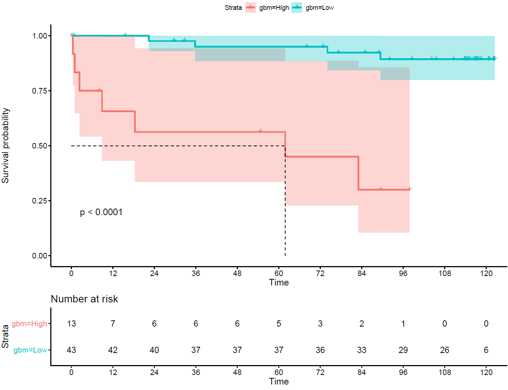

# MSc-dissertation
This is a repository for my dissertation at University of St Andrews 2018-2019. 

The title is "Modelling the prognosis from colorectal cancer on the basis of image analyses". This dissertation presents an analysis of colorectal cancer (CRC) data with clinicopathological and spatial density distribution of macrophage, lymphocytic infiltrates and tumour buds (TBs) variables. This study aims to build a survival model and a classification rule, in order to enhance diagnosis and prediction of CRC survival. The data contain three cohorts, two from Edinburgh and one from Japan. The one from the Edinburgh served as the training dataset while the rest allowed completely unseen validation on the fitted models.

For survival analysis, Cox's models incorporating regularisation and machine learning techniques were used in view of the high dimensionality and collinearity of the data. Due to the class imbalance of the data, oversampling was implemented to compare if any improvements on the prediction performance. Generalised Boosted Regression Models (gbm) performed the best with Harrell's Concordance index (C-index) of approximately 0.7 for both validation cohorts. 

For classification analysis, the survival responses were reduced to a binary outcome, high and low risk group. In view of the non-linearity, machine learning techniques, namely Na\"ive Bayes (NB), Support-Vector Machines (SVM) and gbm models were fitted. Their performances were compared to the performance of pT staging, which is one of the standard cancer classifications. The gbm model again achieved the best predictability, in terms of the log-rank test and Kaplan-Meier (KM) plots. NB with only one predictor related to the interaction of macrophage and lymphocytic infiltrates performed surprisingly well in the unseen Edinburgh validation cohort. This suggests the promising potential of investigating their interaction further.

Kaplan-Meier(KM) plot of the Boosted Regression Models(gbm)

A list of R Script and data files used is described at this [link](./Rlist.pdf).
